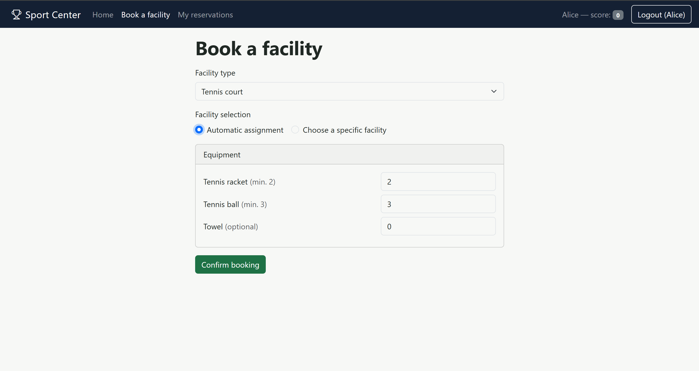

# Sport Center Reservation — Full-Stack Web Application

Web application for booking sports facilities (tennis, basketball, volleyball, soccer, table tennis, cycling) and renting the related equipment. Developed as the final exam project of the **Web Applications** course (M.Sc. Cybersecurity Engineering, Politecnico di Torino).



**Tech stack:** React 19 + Vite + React-Bootstrap (client) · Node.js + Express 5 (REST API) · SQLite · Passport.js

**Security features**
- Session-based authentication (Passport.js, `express-session`)
- Passwords stored as salted `scrypt` hashes
- Optional second factor with **TOTP** (time-based one-time password)
- Server-side input validation (`express-validator`) and per-user authorization checks on every protected API

## How to run

```bash
# server (http://localhost:3001)
cd server
npm install
node index.mjs

# client (http://localhost:5173)
cd client
npm install
npm run dev
```

Test accounts are listed in the *Users Credentials* section below.

---

# Technical documentation

## React Client Application Routes

- Route `/`: public home page. Shows, for every facility type, how many
  facilities exist and how many are currently available, and, for every
  equipment type, the total and currently available quantity. Visible to
  everybody, logged in or not.
- Route `/login`: login form (username/password). If the authenticated user
  has a TOTP secret and has not yet completed the second factor in the
  current session, a second screen asks for the 6-digit TOTP code (or lets
  the user skip it and continue with password-only authentication).
- Route `/book`: booking form to reserve a facility (protected, requires
  login). The user picks a facility type, chooses between automatic
  assignment or direct selection of a specific facility, and sets the
  quantity of mandatory/optional equipment to rent (only the mandatory
  minimum can be requested if the user's score is negative).
- Route `/reservations`: list of the logged-in user's reservations
  (protected, requires login). Each reservation can be edited (add/remove
  rented equipment, except going below the mandatory minimum) or deleted.
- Route `*`: not-found page, with a link back to `/`.

## API Server

### Public (no authentication required)

- GET `/api/facilities`
  - response body: `[{ type, total, available }, ...]` — one entry per
    facility type (tennis, basketball, volleyball, soccer, tabletennis,
    cycling).
- GET `/api/equipment`
  - response body: `[{ type, total, available }, ...]` — one entry per
    equipment type.
- GET `/api/facility-requirements`
  - response body: `{ <facilityType>: [{ equipmentType, minQuantity, mandatory }, ...] }`
    — the mandatory/optional equipment requirements of every facility type,
    used by the client to build the booking form.

### Authentication

- POST `/api/sessions`
  - request body: `{ username, password }` (username is the user's email)
  - response body: user info `{ id, username, name, score, canDoTotp, isTotp }`, or 401 on wrong credentials.
- POST `/api/login-totp`
  - request parameters: requires an authenticated session
  - request body: `{ code }` (6-digit TOTP code)
  - response body: updated user info on success (also resets `score` to 0 if
    it was negative); 401 if the code is wrong, replayed, or expired.
- GET `/api/sessions/current`
  - response body: current user info if authenticated, 401 otherwise.
- DELETE `/api/sessions/current`
  - logs the current user out (destroys the session).

### Facility selection (requires login)

- GET `/api/facilities/:type/available`
  - request parameters: `type` (facility type, e.g. `tennis`)
  - response body: `["T2","T3", ...]` — ids of the specific facilities of
    that type that are currently free (used for "direct selection").

### Reservations (requires login)

- GET `/api/reservations`
  - response body: list of the current user's reservations, each with its
    rented equipment: `[{ id, facilityId, facilityType, createdAt, equipment: [{equipmentType, quantity}] }, ...]`.
- POST `/api/reservations`
  - request body: `{ facilityType, facilityId (optional, for direct selection, null/omitted for automatic assignment), equipment: [{equipmentType, quantity}] }`
  - response body: the newly created reservation, or `409` with `{ error }`
    describing the reason (not enough facilities, not enough equipment of
    type X, too early to reserve again, quantity constraints violated for a
    negative-score user, etc.).
- PUT `/api/reservations/:id`
  - request parameters: `id` (reservation id)
  - request body: `{ addEquipment: [{equipmentType, quantity}], removeEquipment: [{equipmentType, quantity}] }`
  - response body: the updated reservation, or `409` with `{ error }` (e.g.
    trying to remove more than the mandatory minimum, not enough equipment
    available, or the reservation not belonging to the current user).
- DELETE `/api/reservations/:id`
  - request parameters: `id` (reservation id)
  - deletes the reservation, restores facility and equipment availability,
    decreases the user's score by 1, and records the release for the
    30-second re-booking cooldown. Response body: `{}` on success, `409`
    with `{ error }` if the reservation does not exist or does not belong
    to the current user.

## Database Tables

- Table `users` — one row per user: `id`, `email`, `name`, `hash`, `salt`
  (password hash and salt, `crypto.scrypt`-based), `secret` (per-user TOTP
  secret), `lastTotpStep` (replay protection), `score` (integer ≤ 0).
- Table `facilities` — one row per physical facility: `id` (e.g. `T1`),
  `type` (e.g. `tennis`), `available` (0/1).
- Table `equipment` — one row per equipment type: `type`, `total` (stock in
  the whole center), `available` (currently free units).
- Table `facility_equipment` — static configuration: for each
  `facilityType`/`equipmentType` pair, the `minQuantity` required and
  whether it is `mandatory` (1) or optional (0).
- Table `reservations` — one row per reservation: `id`, `user`,
  `facilityId`, `facilityType`, `createdAt`.
- Table `reservation_equipment` — one row per (reservation, equipment type)
  pair: `reservationId`, `equipmentType`, `quantity`.
- Table `releases` — one row per "delete reservation" event: `id`, `user`,
  `facilityType`, `releasedAt`; used to enforce the 30-second re-booking
  cooldown for the same facility type.

## Main React Components

- `App` (in `App.jsx`): top-level component; holds the authentication state
  (`loggedIn`, `user`, `loggedInTotp`) and defines all the routes.
- `GenericLayout` / `NotFoundLayout` (in `components/Layout.jsx`): page
  shell with the navigation bar, and the 404 page.
- `Navigation` (in `components/Navigation.jsx`): navbar with links, current
  user's name and score badge, login/logout button.
- `LoginForm` / `TotpForm` (in `components/Auth.jsx`): username/password
  login form and the second-factor TOTP form.
- `Home` (in `components/Home.jsx`): public overview of facilities and
  equipment availability; also exports the facility/equipment display
  labels shared with the other components.
- `BookingForm` (in `components/BookingForm.jsx`): reservation creation
  form (facility type, automatic/direct selection, equipment quantities),
  enforcing the negative-score restrictions client-side (with the server as
  the source of truth).
- `ReservationsList` / `ReservationCard` (in `components/ReservationsList.jsx`):
  list of the user's reservations, with inline editing of rented equipment
  (users with a negative score can still open the edit form to *remove*
  equipment down to the mandatory minimum, e.g. equipment kept from before
  their score went negative, but cannot add optional or additional
  mandatory equipment) and a two-step (non-native) delete confirmation.

(only _main_ components are listed; minor ones may be skipped)

## Users Credentials

All passwords are `pwd`. All users share the same TOTP secret specified
in the exam text (the same one used during lectures/labs), stored
separately per user in the `users` table, as required.

| Username           | Password | Initial score | Reservations |
|--------------------|----------|----------------|--------------|
| alice@sport.it     | pwd      | 0              | none |
| bob@sport.it       | pwd      | 0              | 1 (tennis court T1, mandatory equipment + 1 optional towel) |
| carol@sport.it     | pwd      | **-1** (negative) | 1 (basketball court B1, minimum mandatory equipment only) |
| dave@sport.it      | pwd      | **-2** (negative) | 2 (volleyball court V1; table tennis table P1 — both with minimum mandatory equipment only) |

After the preloaded reservations, at least one facility of each type and at
least one unit of each equipment type remain available (verified by the
`server/build-db.mjs` seeding script).
